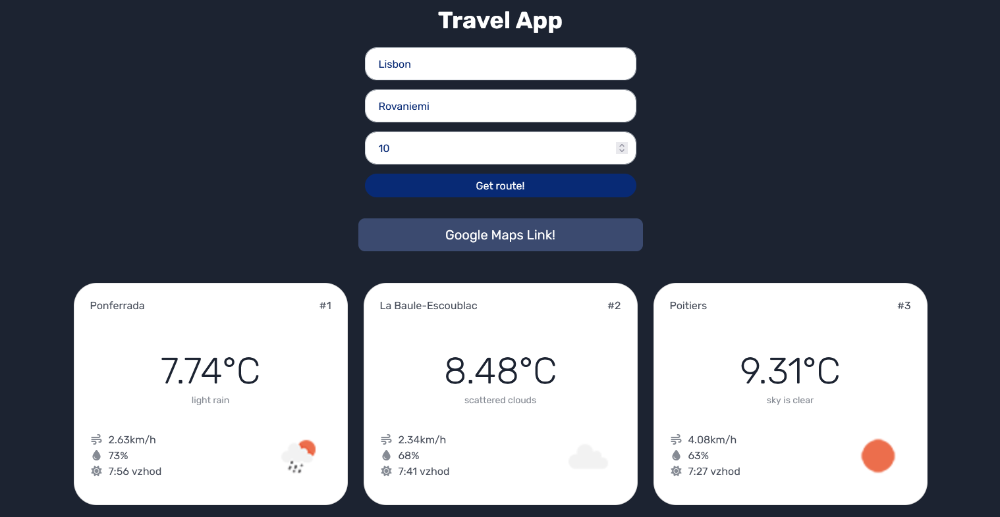
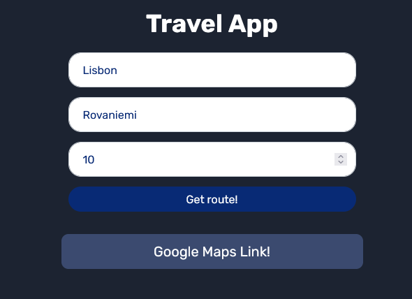
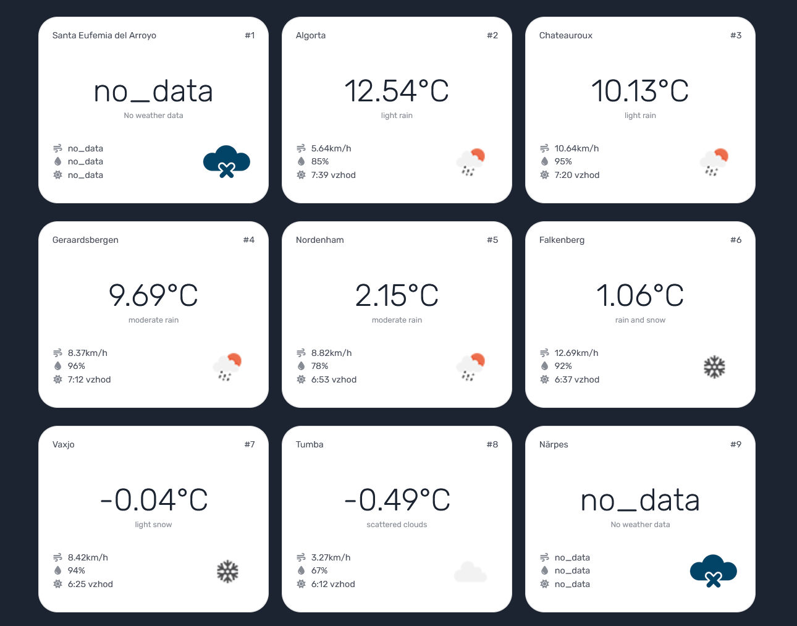
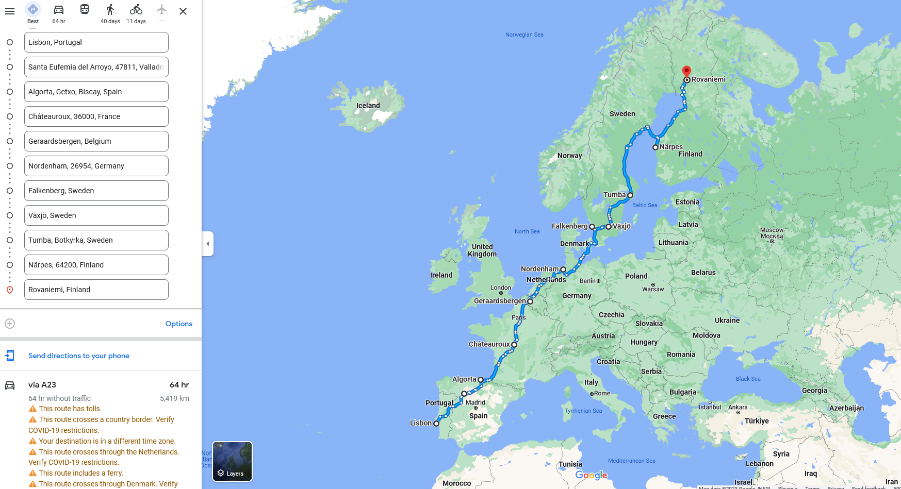

# Route Planning Web App



This is a web app for planning your route from one destination to another. It uses an API to calculate the best route for a given number of days, with stopovers at different cities along the way. Additionally, the app can update the route based on weather conditions, ensuring that you always travel in optimal conditions.
## Features

- Plan a route between two cities
- Specify the number of days you would like to travel
- Get recommendations for stop destinations along the way
- Adjusts the route based on weather conditions 
- Simple and easy-to-use interface
- Interactive map showing your travel route 
- Secure and reliable API for accurate route calculations

## Installation

1. Clone the repository onto your local machine.
2. Set the api_key to your own in the travel.py file in 32 line of code
3. note: you will need to have a (Developer, Professional or Enterprise subscription plan) account, because this code uses (Climatic Forecast 30 days) 

    ```bash
    git clone https://github.com/DinBecarevic/SuperTravelApp.git
     ```
2. Run the travel.py file to start the app.
3. Open localhost:5000 in your browser to view the app.


## Usage

To use the app, simply go to the website and enter the starting point, destination, and number of days you would like to travel. The app will calculate the best route and provide recommendations for stop destinations. If the weather conditions in a stop city are bad, the app will adjust the route to a city with better weather.

## Technologies

The app is built using:

- HTML
- CSS
- Python
- Flask
- OpenWeatherMap API

## Screenshots

Here are some screenshots of the app in action:






## Credits

This app was developed by Din Bećarević as a project for RPA class - ŠCV ERŠ.
